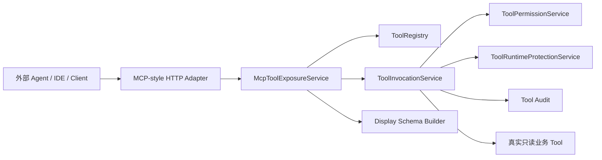
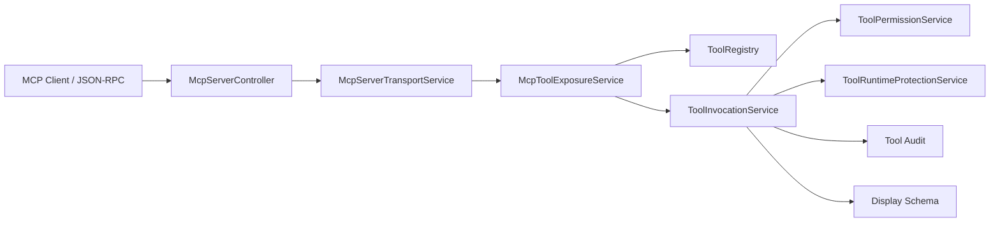

# AI Agent MCP-style Tool Adapter 设计

## 1. 定位

Phase 7.1 的目标是提供一个面试展示级 MCP-style Tool Adapter，说明企业内部已治理 Tool 如何被外部 Agent、IDE 或客户端发现和调用。

当前实现采用 HTTP 形式的 MCP 风格接口，不实现完整 MCP Server 协议栈，不接入真实外部 MCP Client。这样可以快速通过 gateway 18080 演示，同时保留后续升级为标准 MCP Server 的空间。

## 2. 架构关系



MCP-style adapter 只负责安全暴露和协议适配：

- list：从 `ToolRegistry` 读取 ToolDefinition，过滤允许 MCP 暴露的只读 Tool。
- invoke：校验 Tool 是否允许暴露后，调用 `ToolInvocationService`。
- output：将 Tool 执行结果转换为 display 安全视图。

## 3. 暴露边界

默认只暴露安全只读 Tool：

- `mdm.getMaterial`
- `inventory.getBalance`

暴露条件：

- Tool 存在于 `ToolRegistry`。
- Tool 为 `readOnly=true`。
- Tool 在 MCP 暴露白名单中。
- Tool 输出可以转换为 display schema。

禁止暴露：

- 写操作 Tool。
- 内部 HTTP URL。
- API Key、token、authorization、cookie。
- 内部 HTTP header。
- 完整 rawData。
- 完整 prompt 或完整模型响应。

## 4. 接口设计

### 4.1 Tool List

```http
GET /api/v1/ai/mcp/tools
```

返回 MCP 风格工具定义视图：

- name
- description
- inputSchema
- displaySchema
- domain
- category
- routeTags
- readOnly
- requiredPermissions

### 4.2 Tool Invoke

```http
POST /api/v1/ai/mcp/tools/{toolName}/invoke
```

请求体：

```json
{
  "runId": "run-mcp-phase71-material-001",
  "arguments": {
    "materialCode": "MAT-001"
  }
}
```

返回 MCP 风格工具调用结果视图：

- runId
- toolName
- success
- errorCode
- errorMessage
- display.displayTitle
- display.displaySummary
- display.displayFields
- display.displayItems
- latencyMs

响应不返回完整 `rawData`。

## 5. 与标准 MCP Server 的关系

当前实现是 HTTP MCP-style adapter：

- 便于在现有 Spring Boot / Gateway / 租户上下文中演示。
- 复用现有认证、权限、审计、runtime protection。
- 不引入复杂 MCP transport 和外部 client session。

标准 MCP Server 后续可以在协议层替换 HTTP adapter：

- 保留 `McpToolExposureService`。
- 保留 `ToolRegistry` 和 `ToolInvocationService`。
- 新增 MCP transport，把标准 MCP list / call tool 请求转换为当前内部调用模型。

因此 Phase 7.1 的价值不是完整协议覆盖，而是证明企业 Tool 已具备标准化暴露所需的治理基础。

## 6. 面试讲解要点

可以这样讲：

“MCP 的核心价值是让外部 Agent 通过标准方式发现和调用工具。但企业项目不能让外部客户端绕过内部治理，所以我没有重新实现一套工具调用，而是在现有 ToolInvocationService 外面做 MCP-style adapter。外部看到的是 tool list 和 invoke，内部仍然走权限校验、租户上下文、审计、超时重试、熔断和 display schema。后续接标准 MCP Server 时，只需要替换 transport 层，Tool 治理链路不用重写。”
## 7. Phase 9.1 标准 MCP Server transport 最小实现

Phase 9.1 在 Phase 7.1 HTTP MCP-style Adapter 之外，新增一个最小标准 MCP Server transport。当前实现选择项目内 JSON-RPC HTTP transport，而不是直接引入完整外部 MCP Server 协议栈，原因是当前项目的 Spring AI 依赖没有稳定集成 MCP Server starter，直接新增协议依赖会增加测试和本地启动的不确定性。

当前端点：

```http
POST /api/v1/ai/mcp/server
```

支持的最小 MCP 方法：

- `tools/list`
- `tools/call`

### 7.1 与 Phase 7.1 的关系

Phase 7.1 的接口是项目自定义的 HTTP MCP-style Adapter：

- `GET /api/v1/ai/mcp/tools`
- `POST /api/v1/ai/mcp/tools/{toolName}/invoke`

Phase 9.1 的接口是 JSON-RPC 风格 MCP Server transport：

- `POST /api/v1/ai/mcp/server`
- method=`tools/list`
- method=`tools/call`

两者共享同一套内部治理链路：



因此标准 MCP Server transport 不是重新造一套 Tool 执行体系，只是把 MCP `tools/list`、`tools/call` 映射到已有 Tool 暴露和调用服务。

### 7.2 tools/list 映射

`tools/list` 复用 `McpToolExposureService.listTools(...)`，只返回允许 MCP 暴露的只读 Tool。当前默认暴露：

- `mdm.getMaterial`
- `inventory.getBalance`

返回字段包含：

- `name`
- `description`
- `inputSchema`
- `annotations.domain`
- `annotations.category`
- `annotations.routeTags`
- `annotations.readOnly`
- `annotations.requiredPermissions`

不返回内部 HTTP URL、API Key、token、敏感 header、adapter 内部实现细节或完整 `rawData`。

### 7.3 tools/call 映射

`tools/call` 请求中的 `name` 和 `arguments` 会被转换成项目内部 `McpToolInvokeRequest`，然后调用 `McpToolExposureService.invoke(...)`。

调用成功时，响应映射为 MCP content：

- `content[].type=text`
- `content[].text=displaySummary`
- `structuredContent.success`
- `structuredContent.toolName`
- `structuredContent.displayTitle`
- `structuredContent.displaySummary`
- `structuredContent.displayFields`
- `structuredContent.displayItems`
- `structuredContent.latencyMs`
- `isError=false`

调用失败时，返回 JSON-RPC error，并保留真实失败语义，例如 Tool 不存在、未暴露、非只读、权限不足、参数错误、runtime 熔断等。

### 7.4 安全上下文

MCP Server 端点要求通过 gateway 传入用户上下文：

- `X-Tenant-Id`
- `X-User-Id`
- `X-Username`
- `X-User-Roles`

缺少租户或用户上下文时返回稳定错误，不做匿名调用。日志只记录 tenantId、userId、runId、mcpMethod、toolName、success、errorCode、latencyMs、transport，不打印完整 arguments、rawData、prompt、模型响应或敏感 header。

### 7.5 后续升级

后续如果接入标准 Spring AI MCP Server Starter 或外部 IDE/MCP Client，可以保留：

- `ToolRegistry`
- `McpToolExposureService`
- `ToolInvocationService`
- Tool permission / audit / runtime protection / display schema

只替换 transport 层和会话管理层。这样可以避免企业内部 Tool 因协议升级而绕过原有治理链路。
