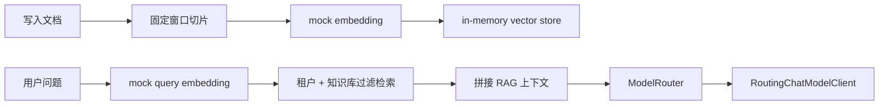

# AI Agent Phase 3 RAG 基础能力说明

## 1. 本阶段目标

本阶段进入正式 Phase 3，实现 RAG 最小可运行闭环：

- 文档写入
- 文档切片
- mock embedding
- in-memory vector store
- 基于 query 的向量检索
- RAG Chat 拼接检索上下文后复用现有模型路由与 Chat 调用链路

本阶段保留 Milvus 作为真实向量数据库方向，但默认不连接 Milvus，不依赖真实 Embedding API，不访问外部网络。

## 2. 当前实现范围

当前落在 `scm-ai-agent` 模块内，后续能力稳定后可按路线图拆分出独立 `scm-ai-rag` 模块。

新增接口前缀：

```text
/api/v1/ai/rag
```

## 3. 核心链路


```mermaid
flowchart LR
    A[写入文档] --> B[固定窗口切片]
    B --> C[mock embedding]
    C --> D[in-memory vector store]
    E[用户问题] --> F[mock query embedding]
    F --> G[租户 + 知识库过滤检索]
    G --> H[拼接 RAG 上下文]
    H --> I[ModelRouter]
    I --> J[RoutingChatModelClient]
```

## 4. 租户隔离

当前 RAG 数据写入和检索都强制依赖网关透传上下文：

- `X-Tenant-Id`
- `X-User-Id`
- `X-User-Name`
- `X-User-Roles`

in-memory vector store 内部按以下 scope 分桶：

```text
tenantId + knowledgeBaseId
```

这保证不同租户即使使用相同 `knowledgeBaseId`，也不会互相检索到对方的文档切片。

## 5. 默认配置

默认模式：

```yaml
ai:
  agent:
    rag:
      embedding:
        mode: mock
      vector-store:
        mode: in-memory
```

默认配置保证：

- 本地无 Milvus 也能启动
- 单元测试不依赖真实 Milvus
- 单元测试不依赖真实 Embedding API Key
- CI 不访问外部模型或外部网络

## 6. Milvus 配置骨架

Milvus 是本项目 RAG 主线向量数据库，但当前阶段只预留配置，不强制启用。

环境变量：

```text
AI_AGENT_RAG_VECTOR_STORE_MODE=milvus
MILVUS_URI=http://localhost:19530
MILVUS_TOKEN=本地环境变量
MILVUS_COLLECTION_NAME=scm_ai_rag_chunks
MILVUS_VECTOR_FIELD=embedding
MILVUS_METRIC_TYPE=COSINE
```

后续接入真实 Milvus 时需要补齐：

- collection schema
- vector field
- scalar metadata fields
- index 创建
- tenantId / knowledgeBaseId filter
- upsert/delete/search 实现

## 7. API 示例

### 7.1 写入文档

```http
POST http://localhost:18087/api/v1/ai/rag/documents
Content-Type: application/json
X-Tenant-Id: 1
X-User-Id: 10001
X-User-Name: admin
X-User-Roles: ROLE_ADMIN
```

```json
{
  "knowledgeBaseId": "kb-project",
  "documentId": "doc-ai-agent-roadmap",
  "title": "AI Agent 路线图",
  "source": "docs/architecture/ai-agent-roadmap.md",
  "content": "这里放文档正文",
  "metadata": {
    "domain": "architecture"
  }
}
```

### 7.2 检索文档

```http
POST http://localhost:18087/api/v1/ai/rag/retrieve
Content-Type: application/json
X-Tenant-Id: 1
X-User-Id: 10001
```

```json
{
  "knowledgeBaseId": "kb-project",
  "query": "这个项目如何做 RAG 租户隔离？",
  "topK": 3
}
```

### 7.3 RAG Chat

```http
POST http://localhost:18087/api/v1/ai/rag/chat
Content-Type: application/json
X-Tenant-Id: 1
X-User-Id: 10001
X-User-Name: admin
X-User-Roles: ROLE_ADMIN
```

```json
{
  "knowledgeBaseId": "kb-project",
  "message": "这个项目如何做 RAG 租户隔离？",
  "taskType": "rag_qa",
  "providerMode": "mock",
  "requestedModel": "qwen-plus",
  "topK": 3
}
```

如果要调用真实 Qwen，可以在模型 Provider smoke test 已验证通过的前提下，将 `providerMode` 改成：

```json
{
  "providerMode": "spring-ai"
}
```

## 8. 日志与安全

当前日志记录：

- `tenantId`
- `userId`
- `knowledgeBaseId`
- `documentId`
- `chunkCount`
- `topK`
- `retrievedCount`
- `modelName`
- `provider`
- `latencyMs`

当前日志不会完整打印：

- 文档全文
- 用户 prompt 全文
- 模型响应全文
- API Key
- Milvus token

## 9. 本阶段刻意不做

本阶段不实现：

- 真实 Milvus Java Client
- 真实 EmbeddingModel 调用
- MySQL RAG metadata 持久化
- 文档批量导入任务
- Tools
- MCP
- Workflow
- 多 Agent
- 长任务编排

## 10. 下一步建议

下一阶段建议实现真实 Milvus adapter：

1. 增加 Milvus Java SDK 依赖。
2. 实现 collection 初始化和 schema 管理。
3. 实现 `MilvusRagVectorStore`。
4. 增加本地 docker-compose 或运维文档。
5. 增加 profile 隔离的 Milvus smoke test，默认 CI 仍不依赖 Milvus。
## 11. Phase 3.1 Milvus Adapter 接入

当前已新增 `MilvusRagVectorStore`，并通过条件装配控制启用时机：

```text
ai.agent.rag.vector-store.mode=in-memory  -> InMemoryRagVectorStore
ai.agent.rag.vector-store.mode=milvus     -> MilvusRagVectorStore
```

默认仍然是 `in-memory`，因此本地无 Milvus 时应用可启动，单元测试也不会连接真实 Milvus。

Milvus Adapter 使用官方 Java SDK，负责：

- 初始化 collection schema
- 创建向量索引
- 写入 chunk 向量
- 按 `tenant_id + knowledge_base_id` 过滤检索
- 返回引用字段：`document_id`、`chunk_id`、`source`、`title`、`content`

详细本地搭建和验证方式见：

```text
docs/operations/milvus-local-setup.md
```
## Phase 3.2：docs 目录手动导入 RAG 知识库

本阶段新增 `docs` Markdown 文档导入能力，目标是让当前项目自己的架构、业务、运维和数据库文档可以快速进入 RAG 知识库。

落地范围：

- 新增 `POST /api/v1/ai/rag/import/docs` 手动导入接口
- 默认扫描 `docs/architecture`、`docs/business`、`docs/operations`、`docs/database`
- 支持配置 docs 根目录、知识库 ID、支持后缀和单次最大导入文件数
- 文档标题优先取 Markdown 一级标题，否则使用文件名
- `source` 使用相对路径
- metadata 包含 `filePath`、`fileName`、`directory`、`extension`、`importSource`
- 复用 `RagService.upsertDocument` 完成切片、mock embedding 和向量写入

默认验证方式仍然是 `in-memory + mock embedding`，不依赖真实 Milvus、真实 Embedding API 或外部网络。

操作说明见：

```text
docs/operations/rag-docs-import.md
```

## Phase 3.3：Milvus 端到端 smoke 与 metadata filter

本阶段在 Phase 3.1 的 `MilvusRagVectorStore` 基础上，补齐真实 Milvus 端到端 smoke 验证能力。

目标：

- 默认仍然保持 `in-memory + mock embedding`
- 只有显式配置 `ai.agent.rag.vector-store.mode=milvus` 时才连接 Milvus
- 使用 mock embedding 写入 Milvus，先验证向量数据库链路，不接真实 Embedding
- 启动时检查 collection schema，避免旧 schema 导致隐性写入失败
- 使用 `upsert` 写入 chunk，保证重复导入同一文档时可以覆盖同一 `chunk_id`
- 检索时强制追加 `tenant_id + knowledge_base_id` 过滤
- 支持 `documentId`、`chunkId`、`chunkIndex`、`title`、`source`、`filePath`、`fileName`、`directory`、`extension`、`importSource` 等 metadata filter
- metadata filter 通过白名单表达式构建器生成，避免任意字符串拼接到 Milvus filter expression

当前 Milvus collection 字段：

```text
chunk_id
tenant_id
knowledge_base_id
document_id
chunk_index
title
source
file_path
file_name
directory
extension
import_source
content
embedding
```

本阶段边界：

- 不实现真实 Embedding API
- 不实现 Milvus 高可用部署
- 不实现 MySQL RAG metadata 持久化
- 不实现 Tools、MCP、Workflow、多 Agent 和长任务编排

Milvus 本地安装、IDEA 配置和 gateway 接口验证方式见：

```text
docs/operations/milvus-local-setup.md
```

## Phase 3.4：真实 Embedding Provider 与检索质量优化

本阶段在 Phase 3.3 Milvus smoke 已验证通过的基础上，开始接入真实 Embedding Provider，让 RAG 从“链路可跑通”进入“语义检索更准确”的阶段。

目标：

- 默认仍保持 `mock embedding + in-memory`，保证本地启动、单元测试和 CI 不依赖外部 API 或真实 Milvus。
- 新增 Spring AI EmbeddingModel 适配器，支持通过配置切换到 DashScope / Qwen Embedding。
- 预留 OpenAI-compatible Embedding 接入方式。
- 保留 metadata filter、tenantId 和 knowledgeBaseId 隔离。
- 日志记录 `embeddingMode`、`embeddingModel`、`vectorDimension`、`topK`、`retrievedCount`、`latencyMs`，但不打印 API Key、文档全文、prompt 全文或模型响应全文。
- 预留 rerank 配置扩展点，本阶段不实现复杂 rerank。

当前配置模式：

```text
ai.agent.rag.embedding.mode=mock
ai.agent.rag.embedding.mode=dashscope
ai.agent.rag.embedding.mode=openai-compatible
```

默认模式：

```text
AI_AGENT_RAG_EMBEDDING_MODE=mock
AI_AGENT_RAG_EMBEDDING_MODEL=mock-embedding
AI_AGENT_RAG_EMBEDDING_DIMENSION=64
```

DashScope smoke 模式：

```text
AI_AGENT_RAG_EMBEDDING_MODE=dashscope
AI_AGENT_RAG_EMBEDDING_PROVIDER=dashscope
AI_AGENT_RAG_EMBEDDING_MODEL=text-embedding-v3
AI_AGENT_RAG_EMBEDDING_DIMENSION=1024
AI_AGENT_SPRING_AI_MODEL_EMBEDDING=dashscope
AI_AGENT_DASHSCOPE_ENABLED=true
AI_AGENT_DASHSCOPE_EMBEDDING_ENABLED=true
DASHSCOPE_API_KEY=本地环境变量
```

OpenAI-compatible 预留模式：

```text
AI_AGENT_RAG_EMBEDDING_MODE=openai-compatible
AI_AGENT_RAG_EMBEDDING_PROVIDER=openai-compatible
AI_AGENT_RAG_EMBEDDING_MODEL=text-embedding-3-small
AI_AGENT_RAG_EMBEDDING_DIMENSION=1536
AI_AGENT_SPRING_AI_MODEL_EMBEDDING=openai
OPENAI_API_KEY=本地环境变量
OPENAI_BASE_URL=兼容接口地址
```

### Milvus 维度注意事项

Milvus collection 的 `embedding` 字段 dimension 在 collection 创建时固定。也就是说：

- mock embedding 默认是 `64` 维。
- DashScope `text-embedding-v3` 本项目 smoke 建议按 `1024` 维配置。
- OpenAI `text-embedding-3-small` 常见配置是 `1536` 维。

如果已经用 mock embedding 创建过 `scm_ai_rag_chunks`，再切换到真实 embedding，必须处理 collection 维度不一致问题：

1. 本地测试可以清空 Milvus 数据：

```bash
docker compose -f deploy/docker-compose/milvus-standalone.yml down -v
docker compose -f deploy/docker-compose/milvus-standalone.yml up -d
```

2. 或者换一个新的 collection 名称：

```text
MILVUS_COLLECTION_NAME=scm_ai_rag_chunks_embedding_v3
```

然后重新调用 docs 导入接口，把文档按真实 embedding 重新写入 Milvus。

### 当前边界

本阶段不做：

- Tools
- MCP
- Workflow
- 多 Agent
- 长任务编排
- 复杂 rerank
- MySQL RAG metadata 持久化

接口列表：

```text
POST /api/v1/ai/rag/documents
POST /api/v1/ai/rag/retrieve
POST /api/v1/ai/rag/chat
```

## Phase 3.5：RAG 重导入清理与检索质量增强

本阶段在 Phase 3.4 真实 Embedding Provider 可用之后，补齐 RAG 知识库长期使用时最容易出现的问题：重复导入、旧 chunk 残留、低质量结果进入上下文、以及 prompt 过长。

目标：

- `RagVectorStore` 新增 `deleteByDocument(tenantId, knowledgeBaseId, documentId)`，让不同存储实现都具备按文档清理旧 chunk 的能力。
- `RagService.upsertDocument` 改为先删除旧 chunk，再写入新 chunk，避免重复导入和文档变短后的脏数据残留。
- `InMemoryRagVectorStore` 和 `MilvusRagVectorStore` 都实现文档级删除。
- Milvus 删除表达式必须强制包含 `tenant_id + knowledge_base_id + document_id`，保证租户隔离和知识库隔离。
- 检索请求支持 `scoreThreshold`，默认 `0` 表示不过滤。
- RAG Chat 拼接上下文时限制 chunk 数量和单 chunk 最大长度，降低 prompt 过长风险。
- 预留 rerank 扩展点，但本阶段不调用复杂 rerank 模型。

关键配置：

```yaml
ai:
  agent:
    rag:
      retrieval:
        default-top-k: 3
        max-top-k: 10
        score-threshold: 0
        max-context-chunks: 5
        max-context-chunk-length: 1200
```

Milvus 删除过滤表达式示例：

```text
tenant_id == 1 and knowledge_base_id == "kb-project-docs" and document_id == "doc-docs-operations-example-md-xxxx"
```

注意：删除旧 chunk 必须发生在写入新 chunk 之前。否则文档内容变短、切片参数变化或 embedding 模型切换后，旧 chunk 会继续参与检索，导致答案引用过期内容。

当前边界：

- 不实现 Tools、MCP、Workflow、多 Agent、长任务编排。
- 不实现复杂 rerank 模型调用。
- 单元测试仍默认使用 `mock embedding + in-memory`，不依赖真实 Milvus、真实 Embedding API 或外部网络。
## Phase 3.6：RAG 文档管理与导入元数据

本阶段在 Phase 3.5 的重导入清理能力之上，补齐 RAG 知识库治理层。

目标：

- 新增 `RagDocumentRegistry` 抽象，用于记录文档治理元数据。
- 默认提供 `InMemoryRagDocumentRegistry`，保证本地启动、单元测试和 CI 不依赖 MySQL。
- 文档写入成功后记录 `tenantId`、`knowledgeBaseId`、`documentId`、`title`、`source`、`filePath`、`fileName`、`directory`、`importSource`、`chunkCount`、`deletedCount`、`embeddingMode`、`embeddingModel`、`vectorStoreMode`、`importBatchId`、`importedAt`、`updatedAt`。
- docs 自动导入时生成 `importBatchId`，并保存导入批次记录。
- 文档删除接口同时删除 Document Registry 记录和 VectorStore 中的 chunk。
- 所有查询和删除都必须携带 `tenantId + knowledgeBaseId` 语义，避免跨租户和跨知识库串数据。

新增接口：

```text
GET    /api/v1/ai/rag/documents?knowledgeBaseId=xxx
GET    /api/v1/ai/rag/documents/{documentId}?knowledgeBaseId=xxx
DELETE /api/v1/ai/rag/documents/{documentId}?knowledgeBaseId=xxx
GET    /api/v1/ai/rag/import/batches
GET    /api/v1/ai/rag/import/batches/{importBatchId}
```

当前边界：

- 不实现 MySQL 持久化，只保留后续替换实现的接口。
- 不实现 Tools、MCP、Workflow、多 Agent、长任务编排。
- 不保存文档全文到 Registry，文档全文仍只用于切片和向量检索。

详细验证方式见：

```text
docs/operations/rag-document-management.md
```

## Phase 3.7：Document Registry 与 Import Batch MySQL 持久化

本阶段在 Phase 3.6 的文档治理抽象之上，补齐可选 MySQL 持久化能力，避免服务重启后 Document Registry 和 Import Batch 元数据丢失。

目标：

- 默认 `mysql` Registry，符合本地和真实服务的持久化使用方式。
- 新增 `MysqlRagDocumentRegistry`，通过 MyBatis Mapper + XML 承载 SQL 逻辑。
- 新增 RAG Registry 专用 MySQL DataSource / SqlSessionFactory / TransactionManager 条件装配。
- 单元测试显式覆盖为 `in-memory`，确保 CI 不依赖真实 MySQL。
- 新增三张表：`rag_document_registry`、`rag_import_batch`、`rag_import_document`。
- docs 自动导入时保存 import batch，并保存 batch 与 document 的关联。
- 文档重复导入时更新 `rag_document_registry`，不新增重复文档记录。
- 文档删除时仍先删除 VectorStore chunk，再把 Registry 记录标记为 `deleted=1`；历史 import batch 和批次文档关联保留用于审计。
- `metadata` 使用 JSON 字符串保存，代码中统一做安全序列化和反序列化。

关键配置：

```yaml
ai:
  agent:
    rag:
      registry:
        mode: mysql
        mysql:
          url: jdbc:mysql://127.0.0.1:3306/scm_ai_agent?useUnicode=true&characterEncoding=utf8&serverTimezone=Asia/Shanghai&useSSL=false&allowPublicKeyRetrieval=true
          username: root
          password:
```

临时无数据库启动时可切换为 in-memory：

```yaml
ai:
  agent:
    rag:
      registry:
        mode: in-memory
```

SQL 脚本：

```text
deploy/sql/ai-agent-rag-registry.sql
```

当前边界：

- 不把向量写入 MySQL。
- 不把文档全文写入 MySQL。
- 不实现 Tools、MCP、Workflow、多 Agent、长任务编排。
- 单元测试仍不连接真实 MySQL、Milvus、Embedding API 或外部网络。

详细验证方式见：

```text
docs/operations/rag-registry-mysql.md
```
