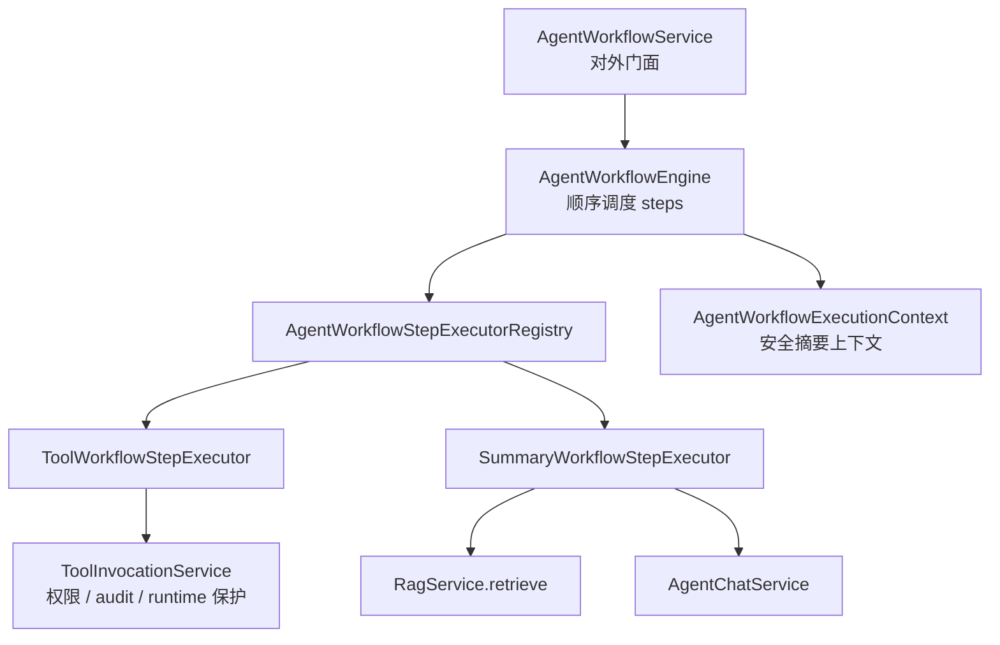

# AI Agent Workflow 最小闭环设计

## 1. 定位

Workflow 表达企业业务流程，例如“查询物料 -> 查询库存 -> 生成补货建议草案”。它关注业务步骤、输入映射、步骤状态和最终业务结论。

Orchestrator 表达 Agent 工具执行过程，例如 Tool plan、stepRef、runtime 保护、权限校验和审计轨迹。它关注模型规划后的工具调用治理。

Phase 6.1 的 Workflow 可以复用 ToolInvocationService，因此权限、审计和 runtime 保护仍然生效，但 Workflow 不等同于 Orchestrator。

## 2. 当前固定流程

`scm_stock_replenishment_advice` 是一个只读演示流程：

1. `query_material`：调用 `mdm.getMaterial` 查询物料。
2. `query_inventory_balance`：调用 `inventory.getBalance` 查询库存余额。
3. `generate_advice`：调用模型生成中文补货建议草案。

该流程不会创建采购单、调拨单、补货单，也不会执行任何写操作。

## 3. 参数来源

- `materialCode`：优先来自请求 `parameters.materialCode`，其次从用户 `message` 中提取，例如 `MAT-001`。
- `materialId`：来自第一步 `mdm.getMaterial` 返回结果中的 `id`，作为第二步 `inventory.getBalance.materialId`。
- `warehouseId` / `locationId`：优先来自请求 `parameters`，其次从用户 `message` 中提取。

参数不足时，对应步骤进入 `SKIPPED` 或 `FAILED`，最终回答说明缺少参数。

## 4. 安全边界

Workflow status 只返回脱敏概要：

- stepCode
- stepName
- stepNo
- stepType
- status
- toolName
- inputResolved
- skipReason
- errorCode / errorMessage
- displayTitle / displaySummary
- safeFields
- latencyMs

接口不返回完整 `rawData`、完整 prompt、完整模型响应、用户凭证、敏感 header 或内部 HTTP header。

## 5. Phase 6.2：Workflow Summary 接入 RAG

Phase 6.2 在固定只读流程 `scm_stock_replenishment_advice` 的 Summary 阶段引入 RAG 检索，但不重构 Workflow 主体。

执行顺序：

1. `query_material` 调用 `mdm.getMaterial`，得到物料安全摘要。
2. `query_inventory_balance` 调用 `inventory.getBalance`，得到库存安全摘要。
3. `generate_advice` 在请求传入 `knowledgeBaseId` 时调用 RAG retrieve，检索库存口径、物料状态、补货规则和人工确认边界。
4. Summary prompt 基于用户问题、Tool safeFields 和 RAG chunk 摘要生成最终中文建议草案。

实时业务事实以 Tool 返回为准；RAG 只负责解释规则、口径和字段含义。如果没有召回知识库内容，Summary 不编造规则。

RAG 结果只放入 `generate_advice.safeFields.rag` 的脱敏概要中：

- knowledgeBaseId
- retrievedCount
- chunks[].documentId
- chunks[].chunkId
- chunks[].title
- chunks[].source
- chunks[].contentSnippet
- chunks[].score

`contentSnippet` 需要限制长度。Workflow status 不返回完整文档原文、完整 `rawData`、完整 prompt、完整模型响应、用户凭证、敏感 header 或内部 HTTP header。

## 6. Phase 6.3：Workflow Engine 最小抽象

Phase 6.3 将固定流程中的步骤执行逻辑抽象为最小 Engine / Executor / Context 结构，解决新增流程时复制 `WorkflowService2` 的问题。

职责边界：

- `AgentWorkflowService`：负责 list definitions、run workflow、get run status，不承载具体步骤逻辑。
- `AgentWorkflowEngine`：创建 run，按 `AgentWorkflowDefinition.steps` 顺序执行步骤，汇总 run 状态。
- `AgentWorkflowStepExecutorRegistry`：按 step definition 找到 executor。
- `ToolWorkflowStepExecutor`：解析 Tool 参数、调用 Tool、构建 display schema 和 safeFields。
- `SummaryWorkflowStepExecutor`：检查前置步骤、按需检索 RAG、生成 Summary prompt、调用模型生成 finalAnswer。
- `AgentWorkflowExecutionContext`：按 stepCode 存取安全输出，例如 `query_material.safeFields.materialId`。

Context 只保存安全摘要，不保存完整 `rawData`、完整 prompt、完整模型响应、用户 token、authorization、cookie、敏感 header 或内部 HTTP header。

新增 Workflow 的扩展方式：

1. 新增 `AgentWorkflowDefinition` 和 steps。
2. 复用已有 `TOOL` / `SUMMARY` executor。
3. 如果出现新的 stepType，再新增对应 `AgentWorkflowStepExecutor`。
4. 参数解析放在 resolver 或 executor 中，保持白名单解析和安全摘要传递。

Phase 6.3 仍不是完整通用工作流平台，不支持 BPMN、并行网关、异步恢复、人工审批或长任务调度。这一层的价值是为面试演示提供“从硬编码流程演进到可扩展步骤执行框架”的企业级设计样板。

## 7. 后续演进

Phase 6.1 不实现通用工作流引擎。后续可以逐步增加：

- Workflow definition 配置化。
- 条件步骤。
- 人工确认节点。
- 长任务和异步状态。
- 与 MCP / 外部编排平台的集成。

Phase 6.4 可以在现有 Engine 基础上增加更面试友好的配置化 definition 或一个新的只读 Workflow 示例，用来证明 Engine 扩展不需要复制 Service。
