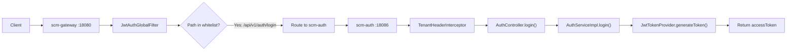
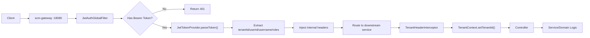
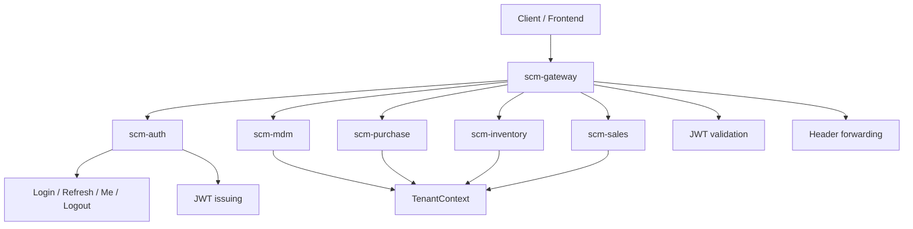

# Auth 与 Gateway 请求链路说明

## 1. 文档目的

本文档用于说明当前项目中认证请求与业务请求的真实流转路径，帮助团队理解以下问题：

- 登录请求是否经过网关
- 登录请求是否会进入 `JwtAuthGlobalFilter`
- 普通业务请求如何完成 JWT 校验
- 网关如何把身份与租户信息透传到下游服务
- `scm-auth`、`scm-gateway`、业务服务三者当前的职责边界

本文档基于当前代码实现整理，不是目标态设计文档。

## 2. 登录请求链路

当调用方通过网关访问登录接口时，请求链路如下：



### 2.1 关键说明

1. 登录请求会先到 `scm-gateway`
2. 登录请求会先经过 `JwtAuthGlobalFilter`
3. 但是 `/api/v1/auth/login` 已经在白名单中，所以不会执行 JWT 鉴权逻辑
4. 网关会直接把请求转发到 `scm-auth`
5. 最终由 `AuthController -> AuthServiceImpl` 执行用户名密码校验和 token 签发

### 2.2 为什么会“经过过滤器但不鉴权”

因为当前网关逻辑是先统一进入过滤器，再判断是否在白名单中。

白名单命中后会直接放行：

```java
String path = exchange.getRequest().getURI().getPath();
if (isWhitelisted(path)) {
    return chain.filter(exchange);
}
```

这意味着：

- 登录请求经过过滤器组件
- 但不进入 Bearer Token 校验分支
- 不会要求 `Authorization`
- 不会解析 JWT
- 不会透传用户身份头

## 3. 普通业务请求链路

对于非白名单业务请求，例如库存、销售、采购相关接口，请求链路如下：



### 3.1 关键说明

1. 非白名单请求必须先经过网关
2. 网关要求请求头带有：

```text
Authorization: Bearer <token>
```

3. 如果 token 缺失或非法，网关直接返回 `401`
4. 如果 token 合法，网关解析出：
   - `tenantId`
   - `userId`
   - `username`
   - `roles`
5. 网关把这些身份信息写入内部请求头，再转发给下游服务
6. 下游服务继续通过 `X-Tenant-Id` 建立当前请求的租户上下文

## 4. 身份与租户信息透传机制

当前网关在 JWT 校验成功后，会向下游附加以下请求头：

```text
X-Tenant-Id
X-User-Id
X-User-Name
X-User-Roles
X-Gateway-Internal
X-Gateway-Secret
```

对应的核心逻辑是：

```java
ServerHttpRequest request = exchange.getRequest().mutate()
        .header(GatewayHeaders.TENANT_ID, String.valueOf(claims.tenantId()))
        .header(GatewayHeaders.USER_ID, String.valueOf(claims.userId()))
        .header(GatewayHeaders.USERNAME, claims.username() == null ? "" : claims.username())
        .header(GatewayHeaders.USER_ROLES, String.join(",", claims.roles() == null ? List.of() : claims.roles()))
        .header(GatewayHeaders.GATEWAY_INTERNAL, "true")
        .header(GatewayHeaders.GATEWAY_SECRET, internalSecret)
        .build();
```

### 4.1 下游服务当前如何消费这些头

当前下游服务最稳定使用的是：

```text
X-Tenant-Id
```

业务服务通过 `TenantHeaderInterceptor` 读取该头，并通过 `TenantContext` 写入当前线程上下文。

这意味着当前业务代码最主要依赖的是租户上下文，而不是完整用户上下文。

### 4.2 当前还没有全面用起来的头

以下头已经透传，但业务服务还没有全面接入使用：

- `X-User-Id`
- `X-User-Name`
- `X-User-Roles`

它们主要是为后续的：

- 用户审计
- 操作人记录
- RBAC 判定
- 内部服务安全收口

做准备。

## 5. 三层职责关系

当前 `Client / Gateway / Auth / Business Service` 的职责关系如下：



### 5.1 各层职责总结

#### `scm-auth`

负责“发证”：

- 登录
- 刷新 token
- 当前用户查询
- 登出接口

#### `scm-gateway`

负责“验票与透传”：

- 白名单判断
- JWT 校验
- 内部身份头注入
- 路由转发

#### 业务服务

负责“消费上下文并执行业务”：

- 从请求头建立租户上下文
- 执行业务 Controller / Service / Domain 逻辑

## 6. 两种访问方式的区别

### 6.1 通过网关访问登录接口

例如：

```text
POST http://localhost:18080/api/v1/auth/login
```

特点：

1. 会先到 `scm-gateway`
2. 会进入 `JwtAuthGlobalFilter`
3. 但因为路径在白名单中，所以不做 JWT 校验
4. 再被转发到 `scm-auth`

### 6.2 直接访问 auth 服务

例如：

```text
POST http://localhost:18086/api/v1/auth/login
```

特点：

1. 不经过 `scm-gateway`
2. 不会经过 `JwtAuthGlobalFilter`
3. 会直接进入 `scm-auth` 的 Spring MVC 处理链
4. 最终进入 `AuthController`

## 7. 当前设计的本质

当前实现的核心逻辑可以概括为：

1. 登录时由 `scm-auth` 负责签发 JWT
2. 业务访问时由 `scm-gateway` 负责统一校验 JWT
3. 网关把 token 中的身份信息转换成内部请求头
4. 下游业务服务继续按租户上下文执行业务

换句话说，当前已经完成的是：

```text
登录 -> 发 JWT -> 网关统一校验 -> 网关透传租户/用户信息 -> 下游执行业务
```

但当前还没有完全做到：

- 数据库版用户体系
- 完整 RBAC 权限判定
- 全量只允许网关内转
- token 黑名单 / refresh token 双 token 体系

## 8. 关键源码位置

- `scm-auth/src/main/java/com/example/scm/auth/controller/AuthController.java`
- `scm-auth/src/main/java/com/example/scm/auth/service/impl/AuthServiceImpl.java`
- `scm-common/scm-common-security/src/main/java/com/example/scm/common/security/JwtTokenProvider.java`
- `scm-common/scm-common-security/src/main/java/com/example/scm/common/security/GatewayHeaders.java`
- `scm-gateway/src/main/java/com/example/scm/gateway/filter/JwtAuthGlobalFilter.java`
- `scm-common/scm-common-web/src/main/java/com/example/scm/common/web/TenantHeaderInterceptor.java`
- `scm-common/scm-common-core/src/main/java/com/example/scm/common/core/TenantContext.java`
